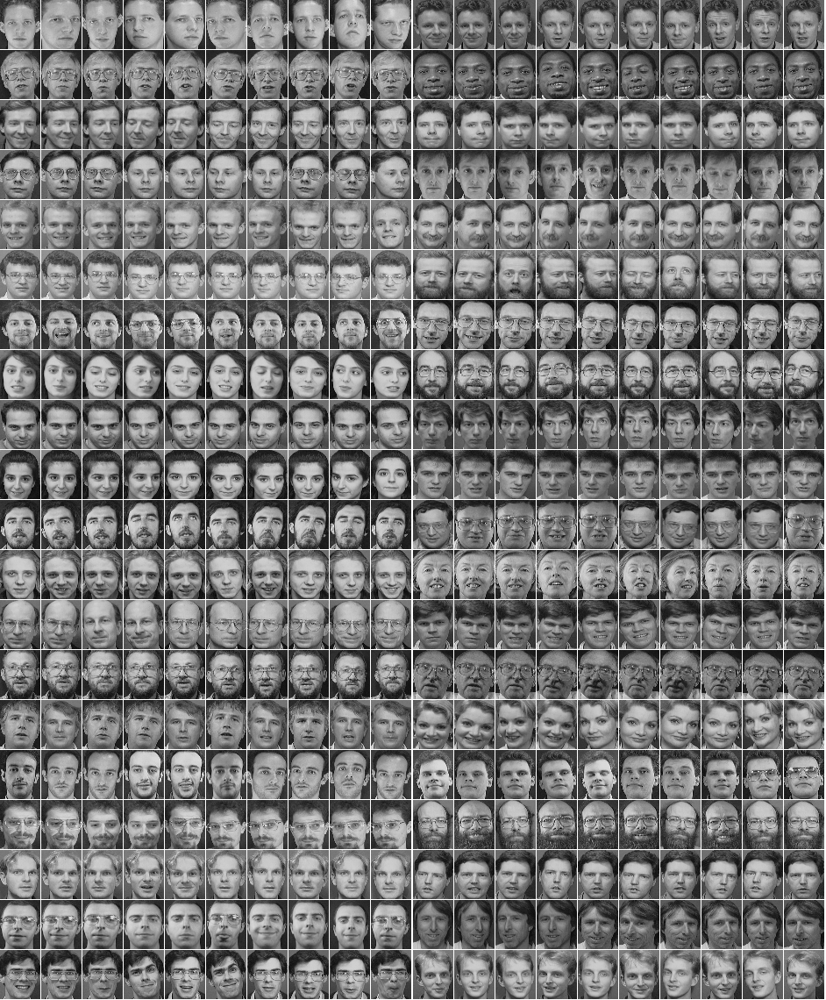

# Convolution neural network for Face Recognition

This is a tensorflow (v12) implentation of deep layer convolution neural network on [ORL faces](http://www.cl.cam.ac.uk/research/dtg/attarchive/facedatabase.html) recognition.

There are ten different images of each of 40 distinct subjects. For some subjects, the images were taken at different times, varying the lighting, facial expressions (open / closed eyes, smiling / not smiling) and facial details (glasses / no glasses). All the images were taken against a dark homogeneous background with the subjects in an upright, frontal position (with tolerance for some side movement).

Network parameters:

Layer 1:

* Filter size = 5        
* Number of filters = 16
* max pooling = 2        

Layer 2:

* filter size  = 5          
* number of filters = 36
* max pooling - 2

Regularisation:  dropout (prob = 0.5)

A successful run will should display a plot of the loss function and accuracy